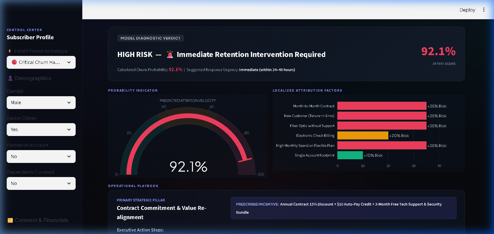
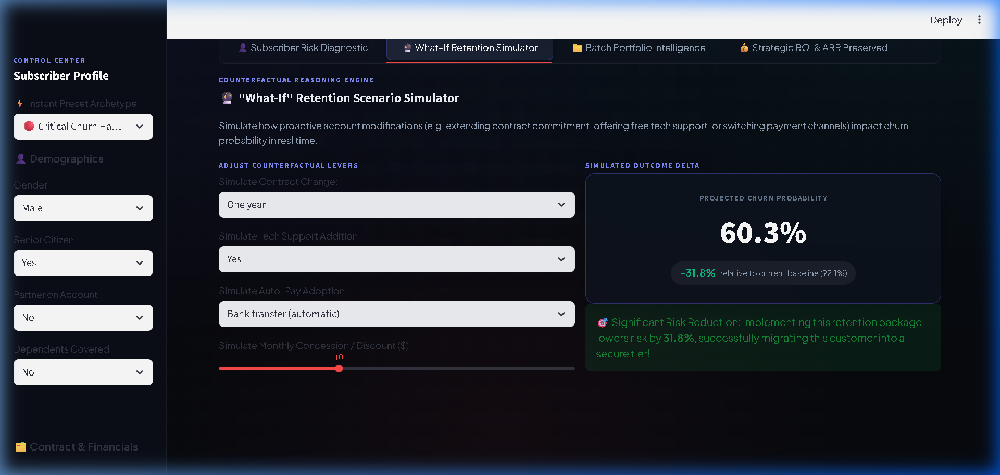

# Retentio.AI | Enterprise Customer Retention & Churn Decision Platform


An end-to-end, enterprise-grade machine learning platform designed to predict subscriber churn, isolate root-cause risk drivers, simulate counterfactual retention offers, and formulate targeted account playbooks in real time.

---

## 📸 Platform Interface & Screenshots

### 1. Real-Time Subscriber Risk Diagnostic & Attribution Breakdown
> High-speed inference with animated neon gauge, probability breakdown, and localized attribution factor bars (+35% Risk impact).



### 2. Counterfactual "What-If" Retention Simulator
> Prescriptive AI engine enabling customer success reps to simulate the exact impact of account incentives (e.g. 1-year contract commitment + tech support bundle reducing churn hazard from 92.1% down to 60.3%).



---

## 🎯 Executive Summary & Business Impact

In subscription businesses (telecom, SaaS, digital media), **customer acquisition costs 5–7× more than retention**. If an enterprise loses 25% of its subscribers annually, it experiences compounding recurring revenue loss.

**Retentio.AI** bridges the gap between pure machine learning and operational business execution:
* **Catches At-Risk Accounts Early:** Delivers a **72.5% minority churn capture rate (Recall)** and an **0.846 ROC-AUC**, prioritizing high-risk detection over misleading baseline accuracy.
* **Explains Why Customers Leave:** Eliminates black-box predictions by breaking down individual risk drivers (e.g. Month-to-month contracts, lack of tech support on fiber optic lines, electronic check payment friction).
* **Simulates the Solution:** Uses counterfactual modeling so teams can test what contract concession or service bundle will save the account before contacting the customer.
* **Scales Across Portfolios:** High-throughput batch inference processes 5,000+ accounts simultaneously, quantifying total Annual Recurring Revenue (ARR) at risk.

---

## 🧠 Machine Learning Architecture & Benchmark Comparison

Trained on the **IBM Telco Customer Churn** benchmark dataset (7,043 customer accounts across 21 features). Preprocessed using an automated Scikit-learn `ColumnTransformer` (median imputation, standard scaling, and one-hot encoding with unseen category protection) to ensure zero data leakage.

### Benchmark Model Comparison (Stratified 80/20 Train-Test Split)

| Architecture | Accuracy | Precision | Recall (Churn Capture) | F1-Score | ROC-AUC | Model Footprint | Status |
|---|---|---|---|---|---|---|---|
| **Logistic Regression** | 80.1% | 65.2% | 54.8% | 59.5% | 0.835 | ~5 KB | Baseline |
| **Random Forest (Unweighted)** | 79.2% | 63.8% | 48.1% | 54.8% | 0.821 | ~19.5 MB | High False Negatives |
| **Tuned XGBoost v2.1 (Active)** | **76.9%** | **54.9%** | **72.5%** | **62.4%** | **0.846** | **~150 KB** | **Champion Model** |

> **Why prioritize Recall over Accuracy?**  
> In imbalanced attrition problems (~73% retained vs ~27% churned), a trivial model predicting "nobody leaves" achieves 73% accuracy while catching zero churners. In business, a **False Negative** (an at-risk customer leaves unnoticed, losing lifetime recurring revenue) is substantially more damaging than a **False Positive** (reaching out with a loyalty perk). Setting `scale_pos_weight=2.0` optimizes the decision frontier for maximum revenue preservation.

---

## ⚡ Core Platform Capabilities

Retentio.AI is structured into 4 purpose-built executive workflows:

```
RETENTIO.AI Platform
├── 1. 👤 Subscriber Risk Diagnostic  → Real-time probability, risk tiering, root causes & action steps
├── 2. 🔮 What-If Retention Simulator  → Counterfactual levers testing churn reduction in real time
├── 3. 📁 Batch Portfolio Intelligence → High-throughput CSV upload, ARR-at-risk analysis & exported roster
└── 4. 💰 Strategic ROI & ARR Preserved→ Financial ROI calculator translating recall into net revenue saved
```

1. **👤 Subscriber Risk Diagnostic:** Evaluates single accounts instantly. Identifies risk tiers (*Low*, *Medium*, *High*) and generates an automated operational playbook with primary strategies and tailored incentives.
2. **🔮 What-If Retention Simulator:** Allows retention teams to test: *"What happens if we offer a 1-year contract and complimentary VIP Tech Concierge?"* Watch the risk delta update live.
3. **📁 Batch Portfolio Intelligence:** Ingests thousands of accounts via CSV, computes total **Annual Recurring Revenue (ARR) at Risk**, and exports a prioritized retention call list.
4. **💰 Strategic ROI & ARR Preserved:** Boardroom value calculator quantifying net annual revenue preserved and campaign efficiency multiples (e.g. **7.8× ROI**).

---

## 🗂️ Project Structure

```
Customer-Retention-Churn-Prediction-System/
├── app/
│   ├── __init__.py
│   ├── app.py                                # Retentio.AI Streamlit interface (Glassmorphic UI)
│   ├── recommendation_engine.py               # Risk classification, drivers & tailored playbooks
│   └── utils.py                               # Pipeline loading utility
├── assets/
│   ├── dashboard_preview.png                 # Main diagnostic dashboard screenshot
│   └── what_if_simulator.png                 # Counterfactual simulator screenshot
├── data/
│   └── raw/
│       └── WA_Fn-UseC_-Telco-Customer-Churn.csv
├── models/
│   └── churn_pipeline.pkl                     # Serialized XGBoost pipeline (~150 KB)
├── notebooks/
│   ├── 01_eda.ipynb                           # Exploratory Data Analysis
│   ├── 03_model_training.ipynb                # Baseline modeling experiments
│   └── 04_model_optimization.ipynb            # Hyperparameter tuning & comparisons
├── src/
│   └── pipeline_training.py                  # Modular training script with CLI flags
├── tests/
│   ├── test_pipeline.py                       # Automated pipeline & inference tests
│   └── test_recommendations.py                # Business logic & driver validation
├── Customer_Retention_Churn_System_Interview_Guide.pdf # 6-page comprehensive interview guide
├── generate_pdf_guide.py                      # Script to re-generate the PDF guide
├── main.py                                    # Central project execution entry point
├── requirements.txt                           # Project dependencies
├── .gitignore
└── LICENSE
```

---

## 🚀 Quickstart & Installation

### 1. Clone the Repository
```bash
git clone https://github.com/Nikhillokesh777/Customer-Retention-Churn-Prediction-System.git
cd Customer-Retention-Churn-Prediction-System
```

### 2. Set Up Virtual Environment
```bash
# Windows
python -m venv venv
venv\Scripts\activate

# macOS/Linux
python3 -m venv venv
source venv/bin/activate
```

### 3. Install Dependencies
```bash
pip install -r requirements.txt
```

---

## 🖥️ How to Run

### Launch the Retentio.AI Dashboard
```bash
python main.py --mode app
# or directly via Streamlit:
streamlit run app/app.py
```
Open **`http://localhost:8501`** in your browser.

### Retrain the Production Pipeline (Optional)
```bash
python main.py --mode train
# or with custom arguments:
python src/pipeline_training.py --model xgboost
```

### Execute Automated Test Suite
```bash
python -m pytest
# All 6 unit tests passing
```

### Re-generate the 6-Page Interview Guide PDF
```bash
python generate_pdf_guide.py
```

---

## 📄 Interview Preparation Guide

Included in the root directory is a comprehensive, 6-page PDF guide:
👉 **`Customer_Retention_Churn_System_Interview_Guide.pdf`**

**What is inside:**
* Plain-English breakdown of all 21 dataset features and why the ML model relies on them.
* Detailed explanation of every UI button, badge, and input slider.
* **Top 15 Most Asked Machine Learning Interview Questions & Answers** (covering class imbalance, data leakage, XGBoost architecture, counterfactual inference, cloud deployment with FastAPI & Docker, and production data drift monitoring).

---

## 📊 Dataset

**IBM Telco Customer Churn** — publicly available on [Kaggle](https://www.kaggle.com/datasets/blastchar/telco-customer-churn).  
Contains 7,043 subscriber accounts across demographics, contract terms, payment methods, and subscribed digital telecom services.

---

## ⚖️ License

Distributed under the [MIT License](LICENSE).
